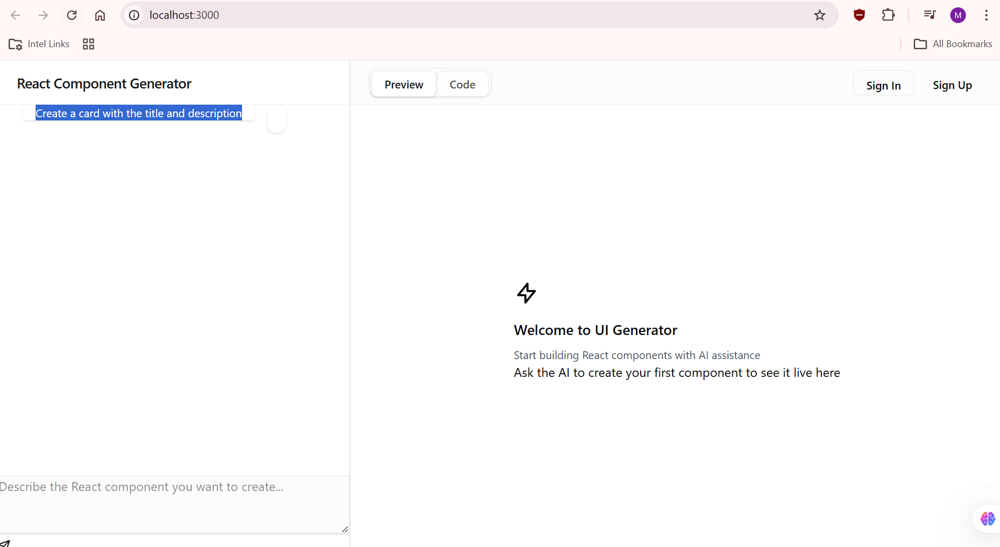

# UIGen

AI-powered React component generator with live preview. Describe a component in plain English and watch it appear instantly.



## Features

- AI-powered component generation using Claude
- Live preview with hot reload
- Virtual file system (no files written to disk)
- Syntax highlighting and code editor
- Component persistence for registered users
- Works without an API key (mock mode generates demo components)

## Tech Stack

- Next.js 15 with App Router
- React 19 + TypeScript
- Tailwind CSS v4
- Prisma + SQLite
- Anthropic Claude AI (claude-haiku-4-5)
- Vercel AI SDK

## Prerequisites

- Node.js 18+
- npm

## Setup

### 1. Install dependencies and initialize the database

```bash
npm run setup
```

This installs all packages, generates the Prisma client, and runs database migrations.

### 2. (Optional) Add an Anthropic API key

Create a `.env` file in the project root:

```env
ANTHROPIC_API_KEY=your-api-key-here
```

> Without an API key the app runs in **mock mode** — it generates a few demo components (card, form, counter) without calling the Anthropic API. To use real AI generation, add a key with available credits from [console.anthropic.com](https://console.anthropic.com).

## Running the App

```bash
npm run dev
```

Open [http://localhost:3000](http://localhost:3000)

## Usage

1. **Anonymous** — use the app right away without signing up
2. **Describe** a React component in the chat (e.g. *"Create a card with a title and description"*)
3. **Preview** the generated component live on the right panel
4. **Switch to Code view** to inspect and copy the generated files
5. **Sign up** to save your components and pick up where you left off

## Database

The app uses SQLite via Prisma. To reset the database:

```bash
npm run db:reset
```

## Contributing

Pull requests are welcome. For major changes please open an issue first.
